# Neuron 90

threshold: 0.6243

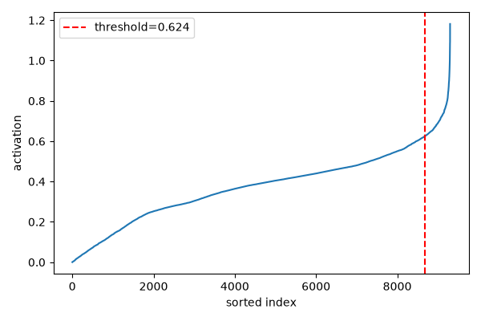

## Cluster 4 (n=131, unique_images=7)

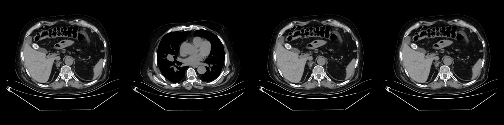

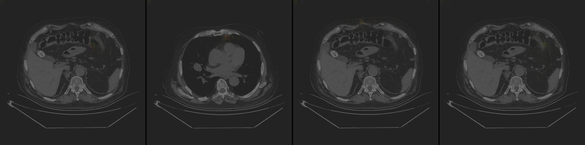

hadamard patterns

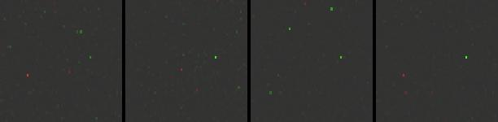

## Cluster 1 (n=41, unique_images=2)

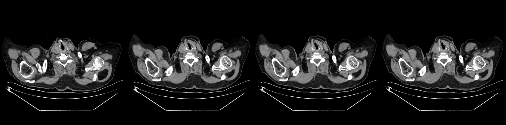

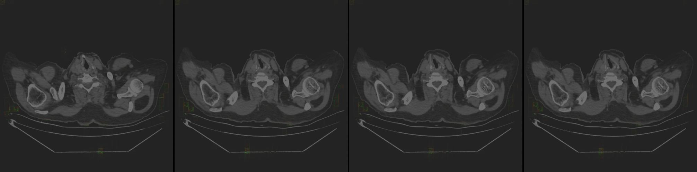

hadamard patterns

## Cluster 0 (n=30, unique_images=2)

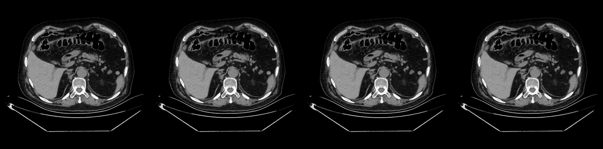

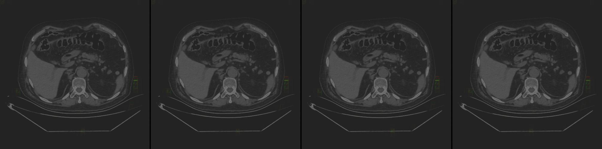

hadamard patterns

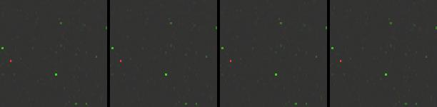

## Cluster 3 (n=13, unique_images=5)

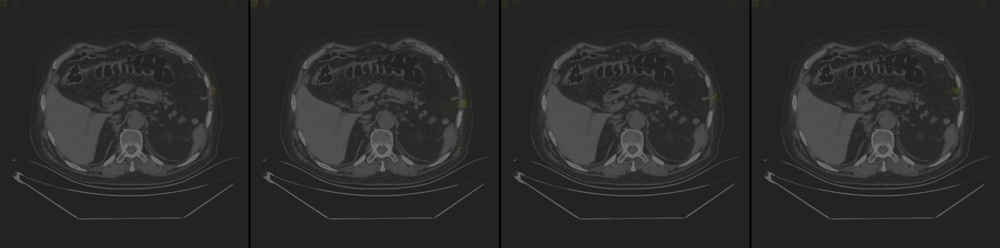

hadamard patterns

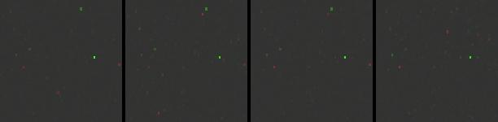

